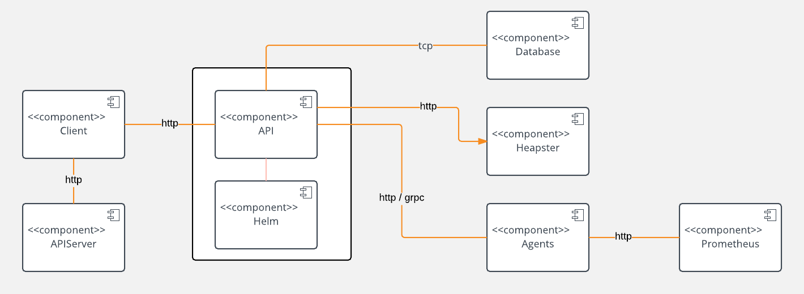

# Backpressure
Framework to load test Kubernetes

Backpressure has different components, all of them wrapped in a Kubernetes chart.

To use `backpressure` you define a `helm` release in a kubernetes namespace and define a set of parameters, for example:

* How many requests per second do you want to do.
* Do you want to create latency in the request-response cycle.
* For how long do you want to apply `backpressure` 

`Backpressure` will read all the services in the namespace and it will start hitting them according to the parameters defined in the release.

The backpressure is applied using kubernetes jobs. There are different jobs with different roles. For example, the option of hitting external services (by external we mean, external to the namespace) is possible using the `ExternalJob` pod.

Backpressure runs a controller in the cluster that inspect the services and allows to configure which kind of `pressure` you want to apply.

Right now there are two kinds of pressure:

* HTTP: you can configure a backpressure job to hit a service over http.
* SQL: you can configure a backpressure job to launch a series of `sql` queries to the backends.

## Architechture

Backpressure has 3 main components that integrate with 4 third party systems:

* Heapster
* Kubernetes API Server
* Postgres
* Prometheus

The following component diagram helps to understand how all the pieces fit together:

